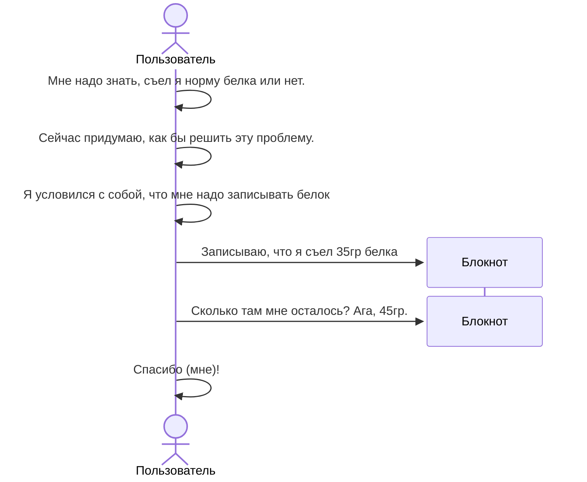
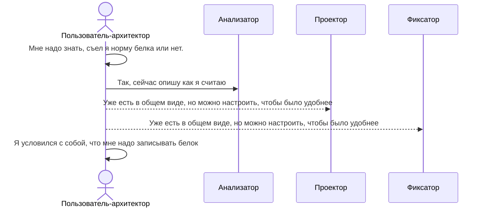
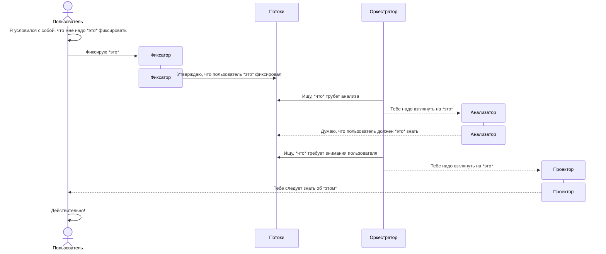
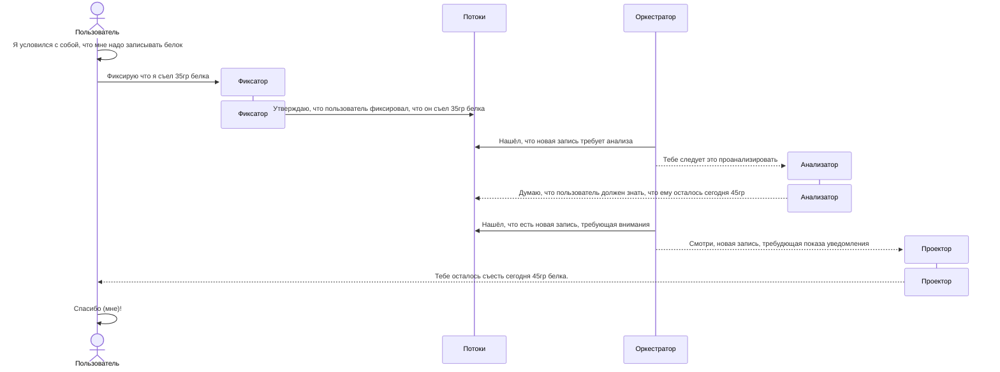

This application is designed to be a layer for processing household data.  There are
abilities to integrate with specific tool


Deployment

```bash
cp .env.example .env
cp ./python/.env.example .env

# *edit env files here* using nano, vim, etc.

# up [dockerized] application & run migrations
make up

# up-to-date repo, then up [dockerized] application, then run migrations, then
#  run integration tests on deployed instance
make update

```

Generate new migrations

```bash
make migrations-generate m="Revision message"
```


Для чего всё это
----------------

Данный проект пытается предоставить user-centric фреймворк для решения проблем,
которые связывает следующее: их решение так или иначе лежит через анализ
персональных данных.

Под user-centric я имею в виду, что главной задачей является предоставить 
решение, действительно подходящее определённому кругу пользователей, потому
и аргументы в пользу расширения ЦА должны рассматриваться с осторожностью.

Вот некоторые обстоятельства, связанные с проблемами такого рода:
1. Возможность композиции различных пользовательских данных нужным образом
    делает в принципе возможным решение такого рода проблем.
2. Пользователь должен иметь возможность полностью контролировать данные,
    вовлечённые в анализ.

Потом допишу

Схемки
------

Пример решения без автоматизации



Пример продумывания решения



Обобщённая схема взаимодействия



Пример взаимодействия


